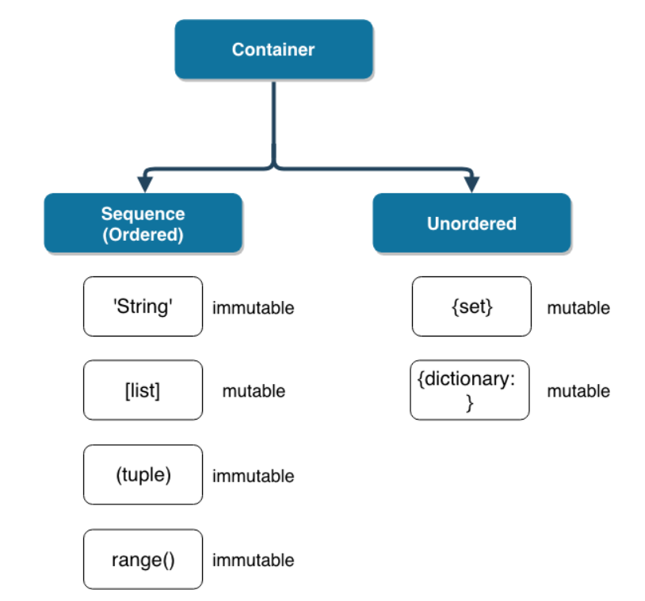

# 0725_TIL


오늘의 TIL

1. __SSAFY 1주차 수업 내용 복습 __- Python 배운 것 중 활용성 높은 것 위주.


# 1. SSAFY 1주차

> 단순히 새로 알게된 내용만 학습


### 메모리 관련 알게된 사실.

- Python에서는 다른 프로그래밍 언어와 다르기 때문에 `정수 자료형(integer)`에서 `overflow(오버플로우)`가 없다. `arbitrary-precision arithmetic`을 사용하기 때문..
- `overflow(오버플로우)` 
  - __'데이터 타입별로 사용 가능한 메모리의 크기가 제한되어있다.'__
  - 표현할 수 있는 수의 범위를 넘어가면 원치 않은 결과가 반환된다. 메모리가 차고 넘치기 때문이다.
- `arbitrary-precision arithmetic`
  - 요약하면 기존에는 정수형 타입의 메모리 할당량을 `x`만큼 제한해놓는 반면, python에서는 __현재 가용한 모든 메모리__를 정수 표현을 하는 시점에 모두 끌어다쓰는 방식이다.


### float

- `float`를 사용하면 계산 과정에서 이상한 현상이 발생한다.
- 큰 문제는 없지만 값을 __비교하는__ 과정에서 문제가 발생할 수 있다.

```python
a = 3.5 - 3.2
print(a == 0.3)

Out: False
```


### 단축평가

- 조건문을 판단할 때, 첫번째 값이 확실할 때는 두번째 값을 확인하지 않는다.
- 따라서 속도가 향상된다.
- `and`의 경우, a를 먼저 만나지만 a가 `True`라고 해도 b를 반드시 확인해야하기 때문에 b가 출력된다.
- `or`의 경우, a가 `True`면 뒤는 더 이상 확인하지 않는다.(`False`이면 b까지 확인.)

```python
a = 'a'
b = 'b'

print("Line 1: ", a and b)
print("Line 2: ", a or b)

Out: 'Line 1: b'
Out: 'Line 2: ?'
```


### 데이터의 분류

> `mutable` vs `immutable`

- 변경 불가능한(`immutable`) 데이터
  - 숫자
  - 글자
  - 참/거짓

- 변경 가능한(`mutable`) 데이터
  - `list`
  - `dict`
  - `set`
  - 사용자가 만든 데이터 타입
- 컨테이너 자료형의 변경 가능 여부.




### 그 외

- `is` 연산자를 통해 동일한 `object`인지 확인할 수 있다.

- `dictionary` 자료형

  - 중복된 key는 존재할 수 없다.

  - keys() 메소드로 keys를 `list` 형식으로 볼 수 있다.

  - values() 메소드로 values를 `list` 형식으로 볼 수 있다.

  - items() 메소드로 keys와 values를 1대1로 이루어진 `tuple` 형식으로 볼 수 있다.

    ```python
    # key와 value 위치 바꾸기.
    
    a = {'a':4, 'b':5, 'c':1, 'd':10}
    b = {}
    
    for k, v in a.items(): # a.items -> [('a', 4), ('b', 1), ...]
        b[v] = k
        
    print(b)
    
    Out: {4: 'a', 5: 'b', 1: 'c', 10: 'd'}
    ```

    

- `string`, `list`,  `tuple`,  `range`,  `set`,  `dictionary` 과 같은 자료형을 __컨테이너형__ 자료라고 한다.

- 이 자료형들은 서로 간의 형변환이 자유롭다.


