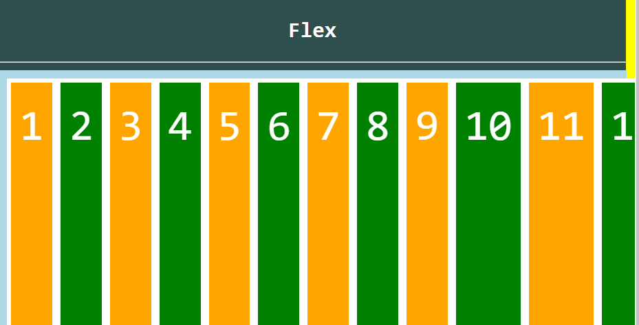

# 0812_TIL


- CSS page layout techniques
  - Float
  - Flexbox
  - Grid


### 1. Float

- 이미지뿐만 아니라 웹사이트를 구성하는 여러 객체들을 Float하여 배치하는 방법.
- Float 속성
  - None: 기본값
  - Left: 요소를 왼쪽으로 띄움. (좌우로 띄워서 한 라인에 표현할 수 있다.)
  - Right: 요소를 오른쪽으로 띄움.


### 2. Flexbox

- 요소
  - Flex Container (부모 요소): 자식 요소를 포함한다. 자식 요소들의 layout을 정한다.
  - Flex Item (자식 요소)
- 축
  - main axis (메인축)
  - cross axis (교차축)


#### 부모 container에 flex 선언시

```css
.flex-container {
    display: flex;
}
```

1. item은 행으로 나열된다.
2. item은 메인축의 시작 선에서 시작한다.
3. item은 크로스축의 크기를 채우기 위해 늘어난다. (1번과 같이 생각해보면 아래 그림이 이해된다.)
4. flex-direction의 default 값이 row 이기 때문에 아래 사진처럼 나열된다.



