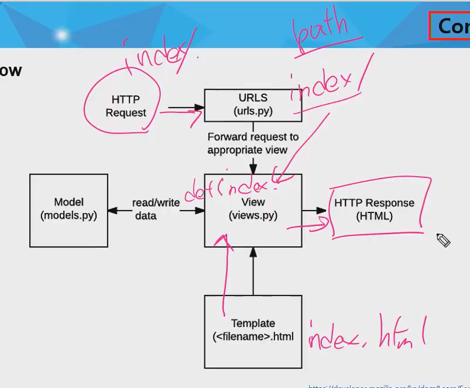

> 0814_TIL


- vscode에서 가상환경 activation 방법.
  - `source C:/Anaconda3/Scripts/activate`
  - 위 명령어 실행 시 (base)로 가상환경 활성화.


## Dynamic Web vs Static Web

- Dynamic Web
  - 동적 웹 페이지
  - 사용자의 요구에 따라 다양한 데이터를 동적으로 보여주는 웹 페이지


- Static Web
  - 정적 웹 페이지
  - github.io 와 같은 웹 페이지
  - 사용자의 요구에 같은 데이터만 보여줌.


## django

- Python Web Framework
  - Web Framework: 웹 페이지를 개발하는 과정에서 겪는 어려움을 줄이는 것이 주 목적으로 어플리케이션 프레임워크의 일종이다.
  - 장고를 활용한 앱: Spotify, Dropbox, Instagram, Delivery Hero

- Python으로 작성된 오픈소스 Web Application Framework로 **모델-뷰-컨트롤러 패턴**을 따르고 있다.
  - 모델-뷰-컨트롤러 패턴(기존은 MVC, Model/View/Controller 이지만 동일한 역할을 MTV로 부른다.)
  - MTV 패턴을 따른다. 기존의 MVC 방식과 유사하지만 조금 다른 방식을 따른다.
    - Model: 데이터 관리
    - Template: 인터페이스(화면)
    - View: 중간 관리(상호 동작)

- 장고 예시(django는 어떻게 동작하는가?)
- 


## django 기본 활용법

- 장고 프로젝트 생성 
  - `django-admin startproject first_project` -> 장고 명령 / 수행할 명령어 / 프로젝트 이름.
- 공통 명령어
  - `python manage.py {수행할 명령어}`
  - 장고 실행: `manage.py`가 있는 경로에서 `python manage.py runserver` 실행.

- 프로젝트 생성 시 주로 활용할 파일
  - `setting.py`
  - `urls.py`
- 앱 만들기
  - `python manage.py startapp {앱이름}`: 앱 시작, 앱 이름은 항상 '복수형'으로 작성한다. ex) article__s__

- `articles` 폴더
  - `models.py`: MTV에서 Model 부분을 활용할 파일이다.
  - `views.py`: View 부분을 활용한 파일이다.

- 앱을 만들고, 등록하는 순서

  - 반드시 앱을 먼저 만들고, 그 이후에 등록한다.
  - `setting.py`의 앱 리스트에 먼저 '등록'을 하면 에러가 난다.

- setting.py에 등록되어 있는 django의 기본 앱 중 하나가 admin 앱이다. local url 뒤에 admin을 붙이면 들어갈 수 있다.

- project 폴더 > urls.py > urlpatterns

  - path(함수이름, view)

  - view 인자의 경우에는 `articles` 폴더의 `view.py`에서 함수를 작성한 후, `from articles import views`를 통해 활용한다.

```python
path('index/', views.index)
```

- `startapp`으로 만든 앱 폴더 `articles` 안에 `templates` 폴더를 만들면 자동으로 해당 폴더의 `html`파일 경로를 인식한다.
  - 따라서 `render(request, 'index.html')`처럼 바깥 폴더에서 가져와도 자동으로 인식한다.


- 
  1. `index/`라는 값으로 `urls.py`에 리스트를 작성하면 요청을 보낸다는 의미. (path 작성)
  2. `views.py`에서 `index`라는 함수를 선언. return 값은 render 함수에 (url, html파일)을 준 값이다.
     - 함수 선언 시에 함수 간 공백은 2줄로 한다. (`PEP-8` 가이드)
  3. 그 전에 `python manage.py startapp {앱이름}`으로 만든 `article`이라는 앱 폴더에 `templates`라는 폴더를 만들고, `index.html`을 작성한다.
  4. django는 해당 url과 html 파일을 잘 rendering해서 사용자에게 요청에 대한 응답을 보낸다.


### 코드 작성 순서(데이터의 흐름을 기준으로)

> url -> views -> template

1. urls.py
2. views.py
3. templates: 해당 앱 폴더 안에 templates 폴더를 만든 후, 그 안에 해당 url의 이름과 동일한 html 파일을 생성한다.
   - html 파일 안에서 views.py 내에 선언한 함수의 return 값인 render(.., [... , ... ])에 3번째 인자 준 dict 형 변수의 key를 사용하여 value값에 접근할 수 있다.
   - Key - Value 값은 대게 같은 변수 이름으로 할당하는 것이 관례적이다.
   - 또한, 3번째 인자인 dict 자료형을 넘겨줄 때 `context` 라는 변수 안에 dict 자료형을 입력하고 인자를 `context`로 넘겨준다.
   - python과 다르게 dict의 마지막을 `,`로 끝낸다.


### URL의 변수화(Variable Rounting)

```python

path('hello/<str:name>/', views.hello),
```


# Django Template Language (DTL)

- django template system에서 사용하는 built-in template system이다.
- 조건, 반복, 치환, 필터, 변수 등의 기능을 제공.
- 프로그래밍적 로직이 아니라 프레젠테이션을 표현하기 위한 것.


### 1. Syntax

- Variable: `{{ 변수명 }}`
- Filter: `{{ variable|filter }}`
- Tags: ``


### form - input

- 브라우저에 요청을 할 때, query의 key 값은 input의 name 속성의 값이다.
- form tag
  - `method="GET"` 은 `input`으로 입력한 데이터를 받기 위한 옵션. form 태그의 기본값이 `GET`이긴 하지만 명시하는 것이 좋다.
  - `action="/catch/"`: throw 페이지에서 보낸 form 태그의 데이터를 `catch`로 보내도록 한다.
- `input tag`
  - 웹 사이트에서 input 창에 넣는 값이 `value`가 되고, `key` 값은 input 태그 속성 중 name 값이 된다.
- 위 form을 통해 입력한 input tag의 값이 k, v가 되어 해당 URL의 `request.GET`에 저장된다.
- 이를 `catch` 페이지에서 받기 위해 views.py에서 catch 함수에서 throw URL을 인자로 받고 GET 인스턴스변수를 활용하면 된다.


# 템플릿 시스템 설계 철학

- 장고는 템플릿 시스템이 **표현**을 제어하는 도구이자 표현에 관련된 로직일뿐이라고 생각한다.
- 템플릿 시스템에서는 이러한 기본 목표를 넘어서는 기능을 지원해서는 안된다.
- template은 표현을 하고, 표현에 필요한 데이터는 views에서 가져온다. 


# 전체적인 흐름

- 프로젝트 생성: `django-admin startproject {프로젝트 이름: 언더바}`
- 앱 생성: `python manage.py startapp {앱 이름: 복수형}`
- 앱 등록: app을 생성한 후에 `settings.py`에 app 등록.
- url 생성: `urls.py`에 `path` 작성.
- T 단계: `views.py`에 해당 url의 동작 방식 작성.
- (해당 url 이름).html을 (app 이름)폴더의 `templates` 폴더에 만든다.
- V 단계: 어떻게 `views.py`에 작성한 (url 이름)함수 안의 데이터를 표현할지 html(장고 파일, 문법)작성.