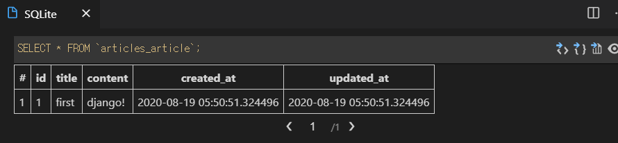

> 0819_TIL


# Django Model

> django는 model을 통해 데이터에 접속하고 관리한다.


- django의 model이 DataBase를 관리한다.


### Database

> 데이터 베이스는 스키마로 구분된 테이블들의 집합.

- 스키마
  - 데이터베이스의 구조와 제약 조건에 관련한 전반적인 명세를 기술한 것.
- 테이블
  - 열(**field**)과 행(**record**)의 모델을 사용해 조직된 데이터 요소들의 집합.
  - SQL에서는 테이블을 관계(relationship)이라고도 한다.


### 테이블 구성요소

- 열(column, field)
  - 각 열마다 고유한 데이터 타입을 가진다. ex) int, 문자, null 타입 등.
- 행(row, record)
  - 고유한 ID를 가진 고객의 정보를 담고 있다. 하나의 행이 하나의 고객의 데이터를 담고 있다.
- PK(Primary Key)
  - `id` 같은 column으로 구분된 데이터. 각 행의 고유값으로 Primary Key로 불린다.
  - 데이터를 구분하기 위한 최소한의 고유값이다.


### ORM

- 객체 지향 프로그래밍 언어
- Django와 SQL 간의 데이터를 변환하는 프로그래밍 기술.
- 장점
  - SQL을 잘 알지 못해도 DB 조작 가능
  - SQL의 절차적 접근 X, 객체 지향적 접근을 통해 높은 생산성 달성.
- ORM 방식
  - DB와 ORM은 SQL로 소통.
  - Django의 model과 ORM은 Python으로 소통.
  - ORM이 DB와 Django의 연결통로가 되는것.
  - 연결 과정에서 SQL의 절차적 방식이 Python의 객체 지향적 방식으로 전환된다.


### Field 종류

- **CharField(max_length=None)**
  - 길이의 제한이 있는 문자열을 넣을 때 사용
  - `max_length`가 필수인자.
  - 필드의 최대 길이, 데이터베이스와 django의 유효성 검사(데이터가 조건에 맞는지 확인)에서 사용
- **TextField()**
  - 글자의 수가 많을 때 사용
- DateTimeField()
  - 최초 생성 일자: `auto_now_add=True`(최초 생성할 때의 시간만 저장.) 
    - django ORM이 최초 데이터 입력시에만 현재 날짜와 시간으로 갱신
    - 테이블에 어떤 데이터를 최초로 넣을 때
  - 최종 수정 일자: `auto_now=True`
    - dajngo ORM이 save를 할 때마다 현재 날짜와 시간으로 갱신.


# Migrations

> django가 model에 생긴 변화를 반영하는 방법


### makemigrations

> 실행 시마다 000# 파일이 생긴다. 변경 사항을 기록하는 `git add`과 유사하다.

- model을 변경한 것에 기반한 새로운 마이그레이션(설계도)을 만들 때 사용.(model classes -> migrations -> DB.table)
- 모델을 활성화하기 전에 DB 설계도를 작성
- 생성된 마이그레이션 파일은 데이터베이스 스키마를 위한 버전관리 시스템이라고 생각.


### migrate

> makemigrations로 기록 사항을 만든 후, `git commit`처럼 사용하는 명령어

- 마이그레이션을 DB에 반영하기 위해 사용 -> 테이블 생성.
- 작성된 마이그레이션 파일들을 기반을 실제 DB에 반영
- 모델에서의 변경 사항들과 DB의 스키마가 동기화를 이룸.


### sqlmigrate

- 해당 마이그레이션 파일이 SQL문으로 어떻게 해석되어서 동작할지 미리 확인하기 위한 명령어


### showmigrations

- 마이그레이션 파일들의 migrate 여부를 확인하기 위한 명령어

- 마이그레이션 기록을 확인하기 위한 명령어
- 각각의 상태(X표시가 정상)를 확인할 수 있다.


### Model의 중요 3단계 과정

1. models.py: 변경사항(작성, 수정, 삭제 등) 발생
2. makemigrations: 설계도 만들기
3. migrate: DB에 적용


### 작동 방식

- miration 파일인 0001_initial.py 파일이 만들어지면,
- 해당 파일은 ORM을 거친 후,
- SQL 구문으로 해석이 된 후, (`python manage.py sqlmigrate {앱이름} {파일번호 ex) 0001}`로 확인가능.)
- DB(`db.sqlite3`)에 적용이 된다.
- 처음 `migrate` 명령어를 수행하면, `setting.py`에 등록된 최초의 app들에 대한 테이블이 만들어진다.


# DB API

```python
# DB API 예시.
# django manager를 통해 만들어진 명령어.

Article.objects.all()

# Class Name / Manager / QuerySet API
```


### Manager 

- django 모델에 데이터베이스 query 작업이 제공되는 인터페이스
- 기본적으로 모든 모델 클래스에 objects라는 manager가 자동으로 추가되어 있다.


### QuerySet

> 데이터베이스 조작을 위한 QuerySet API method들은 공식문서를 반드시 참고.

- 데이터베이스로부터 전달받은 객체 목록
- queryset 안의 객체는 0개, 1개 혹은 여러개일 수 있다.
- 데이터베이스로부터 조회, 필터, 정렬 등을 수행할 수 있다.


- Django에서 사용가능한 모듈 및 메서드를 대화식 Python Shell에서 사용하려고 할 때,
  - `python manage.py shell`: 기존 django shell
  - `python manage.py shell-plus`: 자동으로 django의 패키지를 `import`한다.


### 작업 순서.

- 동작은 instance를 만들어서 활용한다.

  - `article = Article()` : `Article()` 클래스의 인스턴스 생성.

  - ```python
    # 확인.
    In [3]: article
    Out[3]: <Article: Article object (None)>
    ```

- 인스턴스의 클래스 변수로 접근. 인스턴스의 변수 명명

  - `article.title = 'first'`
  - `article.content = 'django!'`

- 아직은 테이블에 데이터가 쓰여지지 않았다.(row 한 줄이 아직 생기지 않음)

  - `article.save()`를 해줘야 테이블에 방금 입력한 데이터가 입력된다.
  - save를 해주면 `article` 인스턴스에 None 값 자리에 PK 값이 생성된다. 

- 결과

  - 


# CRUD

### CREATE

데이터를 작성하는 3가지 방법

1. 첫번째 방법(객체 생성 후, 변수 지정)
   - `article = Article()`: 모델 클래스로부터 인스턴스 생성
   - article 인스턴스로 클래스 변수에 접근해 해당 인스턴스 변수 변경(`article.title = 'first'`)
   - `article.save()` 메서드 호출 -> db에 실제로 저장이 완료된다.
   - `article.pk`를 통해 `id` 조회 가능.


2. 두번째 방법(키워드 인자 활용)
   - 클래스로 인스턴스 생성 시 keyword 인자를 함께 작성.
   - `article = Article(title='second', content='django!')`
   - `article.save()` 메서드 호출.


3. 세번째 방법(쿼리셋 객체 활용.)

   - create() 메서드를 사용하면 퀘리셋 객체를 생성하고 `save`하는 로직이 한번의 step으로 된다.

   - `Article.objects.create(title='third', content='django!!')`


---


### READ

> QuerySet을 return하는 method(Y)와 return 하지 않는 method(N)를 잘 구분하자.

`all()`(Y)

- `QuerySet` return
- 


`get()`(N)

- 객체가 없으면 `DoesNotExist` 에러가 발생
- 객체가 여러개일 경우는 `MutipleObjectReturned` 에러가 발생
- 위와 같은 특징을 가지고 있기 때문에 unique 혹은 Not Null 특징을 가지고 있으면 사용할 수 있다.
  - 주로 pk를 활용한다.


`filter()`(Y)

- 지정된 조회 매개 변수와 일치하는 객체를 포함하는 `QuerySet`을 return 한다. (없으면 빈 쿼리셋 리턴.)


---


### UPDATE

> 값을 바꾸고 반드시 save를 해야 수정 사항이 반영된다.
>
> 매번 바꿀 때마다 `updated_at`도 바뀌게 된다.

- 바꾸고자 하는 객체를 가져와서 값을 바꾼 후, `.save()` 메서드를 호출한다.


---

### DELETE

- 한 번 삭제한 pk 값은 더 이상 쓰지 않는다.
- `객체.delete()`


# admin 계정 만들기

> DB를 만들지 않은 상태에서(빈 상태에서) superuser를 만들지 않도록 한다.

- `python manage.py createsuperuser`


